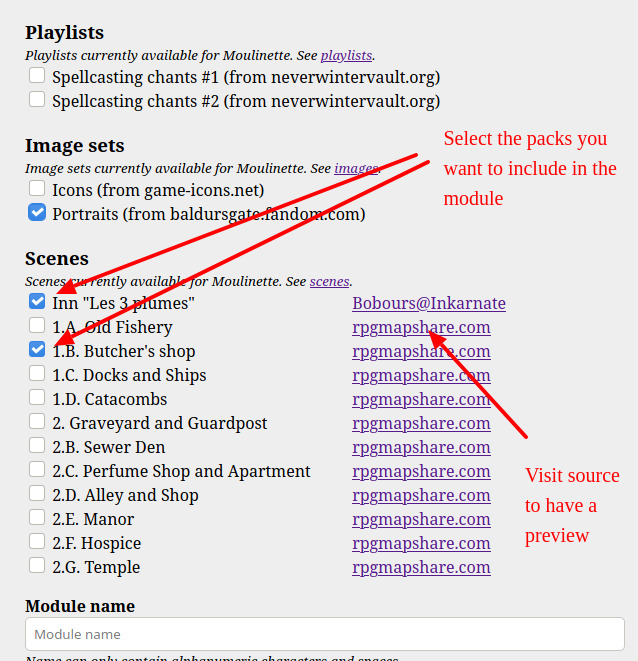
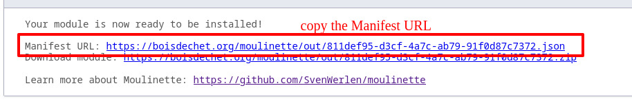
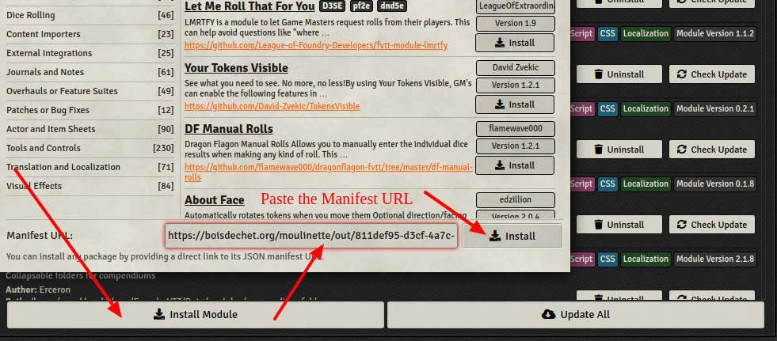
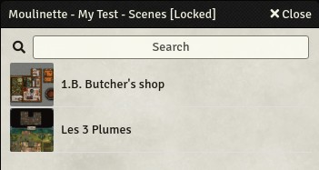

# How to generate and install modules

This page describes how to use [Moulinette Bundler for Foundry VTT](README.md).

## Step by step

* Visit [Moulinette Bundler webpage](https://boisdechet.org/moulinette/bundler/fvtt/task)
* Check the packs you'd like to include in the modules

* Enter the name of the module as you want it to appear in Foundry after installation
* Enter your email address
* Submit
* After a few seconds, you'll receive a first email. Click on the link to confirm.
* Moulinette will now generate your module by downloading the content and packaging it
* When your module will be ready, you'll get a new email with a few links. Copy the Manifst URL

* In Foundry, you can now easily install the generated module
  * In the Configuration and Setup | Add-on Modules | Install Module
  * Paste the Manifest URL from the received email
  * Click Install

* You can now use it in your Foundry worlds
  * Enable the module `Moulinette - <module name>` in Game Settings | Manage Modules in your world
  * Scenes and playlists will be available as compendium
  * Images are available in the `modules/moulinette-<module name>/images` folder
  

Enjoy!
