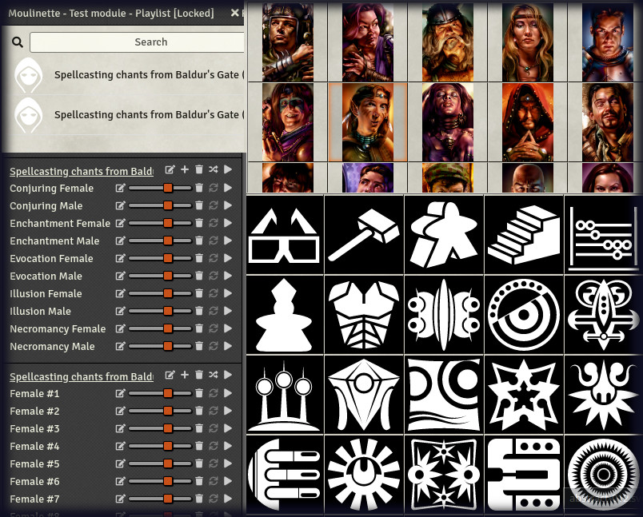
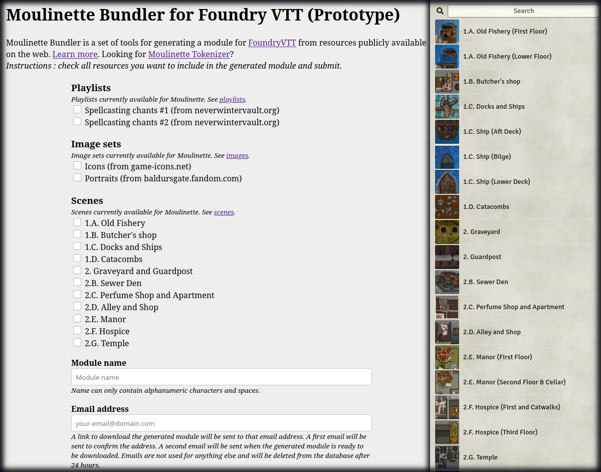

# Moulinette Bundler for Foundry VTT

---

:information_source: in most cases, you'll probably better appreciate the [Moulinette module for FoundryVTT](https://github.com/SvenWerlen/fvtt-moulinette).

---

Moulinette Bundler is a set of tools for generating a module for [FoundryVTT](https://foundryvtt.com/)  based on packs from the community and the vastness of the web.

Try it: [Moulinette Bundler for FoundryVTT demo](https://boisdechet.org/moulinette/bundler/fvtt/task)

**How does Moulinette Bundler work ?**

* Moulinette Bundler takes as input a list of `JSON` files that specify which resources (publicly available on Internet) to download and include into a module.
* It downloads each resource
* It finally generates a Foundry VTT module (including the compendiums and `module.json`)
* You can then easily install the generated module by using the `Manifest URL` provided during the process.

**Need an example ?**

Here is a sample `JSON` file defining a playlist (see [spellcasting-chants-from-baldursgate1.json](https://github.com/SvenWerlen/moulinette-data/blob/main/playlists/lists/spellcasting-chants-from-baldursgate1.json)):

```json
{
  "name": "Spellcasting chants from Baldur's Gate (#1)",
  "type": "playlist",
  "source": "NeverWinterVault|https://neverwintervault.org/project/nwn2/audio/sound/spellcasting-chants-baldurs-gate",
  "list": [
    {
      "name": "Conjuring Female",
      "url": "https://neverwintervault.org/sites/all/modules/pubdlcnt/pubdlcnt.php?fid=27231|Override/vs_chant_conj_hf.wav"
    },
    {
      "name": "Conjuring Male",
      "url": "https://neverwintervault.org/sites/all/modules/pubdlcnt/pubdlcnt.php?fid=27231|Override/vs_chant_conj_hm.wav"
    },
  ...
```

* Bundler processes that file by downloading the archive, unzipping it and extracting the desired files. 
* Bundler generates a compendium and inserts a new entry for the playlist
* Bundler generates a `module.json` file and finalizes the module 

An example of the output of a module which includes some of the available playlists and image packs.



Another example of the output of a module which includes the scenes for Pathfinder Adventure Path "Curse of the Crimson Throne". 



## Try it (online)

Visit [Moulinette Bundler for FoundryVTT](https://boisdechet.org/moulinette/bundler/fvtt/task) and follow the instructions.

## Support me on Patreon

If you like my work and want to support me, consider becoming a patreon
[https://www.patreon.com/moulinette](https://www.patreon.com/moulinette)
