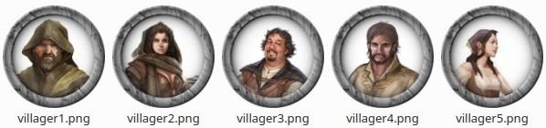

# Moulinette Tokenizer

Moulinette Tokenizer is a set of tools for generating a bundle of tokens from images publicly available on the web.

**Why another tokenizer ?** 

There a lot of existing tokenizers available. However, I couldn't find one supporting the following use cases:
* I want to apply a different frame on an existing set of images wihtout having to redo the work manually.
* I want to share my set of tokens with others without infringing copyright

**How does Moulinette Tokenizer work ?**

* Moulinette Tokenizer takes as input a `JSON` file that specifies which images (publicly available on Internet) to use and some other details about how to manipulate it.
* It downloads each of them and applies the desired transformation
* It finally generates your personnal bundle and makes it available to you
* If you want to apply another frame, you can easily reuse the same input file with other configurations and get a new bundle of tokens.
* If you want to share the bundle with others, rather than sharing the bundle itself (images probably under copyright), you can share the input file and let others use Moulinette Tokenizer to generate their own bundle.

**Need an example ?**

Here is a sample `JSON` input file (see [dwarfs.json](https://github.com/SvenWerlen/moulinette-data/blob/main/tokens/packs/samples/dwarfs.json)):

```json
{
  "name": "dwarfs.json",
  "type": "token",
  "list": [
    {
      "name": "dwarf1",
      "url": "https://static.wikia.nocookie.net/brenielverse-rpg/images/9/9b/Dwarf_Portrait_Male.jpg/revision/latest/top-crop/width/360/height/450?cb\u003d20170324140209",
      "offsetX": -17,
      "offsetY": -8,
      "scale": 0.6441780302739868
    },
    {
      "name": "dwarf2",
      "url": "https://i.pinimg.com/originals/d9/9b/12/d99b12efe7d6e5d104cf23a1ae0fc655.png",
      "offsetX": -18,
      "offsetY": 14,
      "scale": 0.3680633042888175
    }
  ...
```

The Moulinette Tokenizer processes that file by downloading the images, manipulating the images and applying a frame. The result is then:



## Try it (online)

Visit [Moulinette Tokenizer](https://boisdechet.org/moulinette/tokenizer/task) and follow the instructions.

## Try it (application)

Download the application and it locally
* [Moulinette 2.2-rc.18 for Linux 64-Bit](https://github.com/SvenWerlen/TokenTool-Moulinette/releases/download/2.2-rc.18/moulinette-2.2-rc.18.deb) (.deb)
* [Moulinette 2.2-rc.18 for Windows 64-Bit](https://github.com/SvenWerlen/TokenTool-Moulinette/releases/download/2.2-rc.18/Moulinette-2.2-rc.18.exe) (.exe)

*NOTE : this is still a pre-release and `.exe` has not been signed with a valid certificate! You'll get warnings from Windows Defender and the browser that the application is dangerous. If you are not confortable installing it, rather try the online version.*


